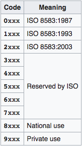
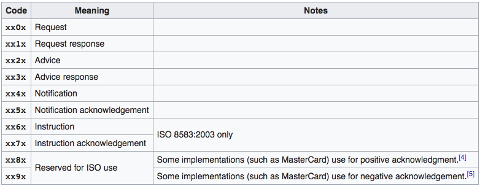

## Apa Itu ISO ?

>>ISO (International Organization for Standardization) adalah badan penetap standar internasional yang terdiri dari wakil-wakil dari badan standardisasi nasional setiap negara.

ISO biasanya akan menetapkan suatu standarisasi untuk kebutuhan tertentu misalnya seperti penetapan standarisasi sistem keamanan rantai pasokan pada ISO 28000, sistem terhadap manajemen lingkungan pada ISO 14001 dan lain - lain nya. Penetapan standarisasi ini berguna untuk membuat keseragaman / standarisasi antar negara sehingga memudahkan dalam proses integrasi.

## Apa Itu ISO 8583 ?

>>ISO 8583 adalah sebuah standart internasional untuk transaksi financial.

ISO 8583 ini sudah sangat banyak digunakan untuk hal transaksi financial terutama di dunia perbankan. ISO 8583 ini tidak hanya dapat digunakan di bagian perbankan melainkan dapat digunakan di bagian lain yang berhubungan dalam hal transaksi financial. Contoh implementasi dari ISO 8583 sendiri adalah terletak pada mesin ATM dan EDC, dimana pada saat proses transaksi, mesin ATM atau EDC akan mengirimkan data dalam bentuk ISO 8583 ke server untuk diproses.

## Komponent ISO 8583

Secara global, komponent ISO 8583 terdiri dari :

* Message Header : biasanya digunakan sebagai penanda awal dari sebuah message
* Application Data : bagian ini berisi dari inti ISO 8583
* Message Trailer : digunakan sebagai penanda akhir sebuah message atau pembeda antar message

Pada artikel ini, penulis hanya akan membahas mengenai application data dikarenakan hal yang paling banyak dibahas atau yang perlu dipelajari adalah pada bagian application data. Di dalam application data terdiri dari beberapa komponent yaitu : MTI (Message Type Indicator), Bitmap dan Data Element.

### MTI (Message Type Indicator)

>>MTI (Message Type Indicator) adalah 4 digit angka yang berfungsi sebagai message utama dan penjelasan mengenai tentang tipe pesan.

Di dalam MTI terdapat 4 digit dimana 4 digit tersebut dibagi menjadi :

* Message Version : berfungsi mendefinisikan versi ISO 8583 yang digunakan, berikut adalah versi yang dapat digunakan :



* Message Class : berfungsi mendefinisikan tujuan message yang akan dikirim, berikut adalah tabel untuk message class.


* Message Function : berfungsi sebagai type dari message, misalnya apakah dia berupa request, response, advice dan lain - lain nya. berikut adalah tabel untuk message function.



* Message Origin berfungsi untuk mendefinisikan sumber pengirimkan data misalnya seperti acquirer (instansi keuangan yang menerbitkan kartu pembeli), issuer (instansi keuangan yang berhubungan langsung dengan mesin EDC penjual) dan lain - lain. erikut adalah tabel untuk message origin.


Berikut adalah contoh sederhana dari MTI.

0100 artinya Authorization Request dimana

* 0 -> ISO 8583 tahun 1987
* 1 -> Authorization message
* 0 -> Request
* 0 -> Acquirer

Contoh response nya 0110 artinya Authorization Response dimana

* 0 -> ISO 8583 tahun 1987
* 1 -> Authorization message
* 1 -> Request response
* 0 -> Acquirer

### Bitmap

>>Bitmap adalah salah satu komponent dari ISO 8583 dimana terdiri dari 16 angka (dalam bentuk hexadecimal) atau lebih tergantung dari apakah terdapat secondary dan tertiary bitmap yang aktif.

Bitmap terdiri dari hexadecimal, dimana hexadecimal ini nantinya akan dirubah terlebih dahulu menjadi biner. Biner yang terdapat dalam bitmap yang telah dirubah dari hexadecimal menjadi biner berfungsi untuk melakukan lookup terhadap posisi data element yang akan digunakan. Untuk melakukan lookup terhadap posisi data element maka digunakan biner yang aktif, dimana biner yang aktif bernilai 1 sedangkan biner yang non aktif bernilai 0.

Di dalam bitmap, terdapat beberapa bitmap yaitu :

* Primary Bitmap : ini merupakan bitmap yang wajib untuk setiap ISO 8583, data element yang aktif pada bitmap ini yaitu dari biner 1 sampai 64.
* Secondary Bitmap : merupakan bitmap dengan data element yang aktif pada biner 65 sampai 128.
* Tertiary Bitmap : merupakan bitmap dengan data element yang aktif pada biner 129 sampai 192.

#### Cara Menghitung Bitmap Dari Hexadecimal

Untuk menghitung bitmap, maka kita perlu melakukan convert dari hexadecimal menjadi biner. Berikut adalah tabel convert yang biasanya digunakan.


Misalnya terdapat contoh bitmap : F23C449108E080000000000000000021

dimana bitmap diatas terdiri dari 32 karakter maka dapat dipastikan bitmap diatas terdapat Secondary bitmap. Cara merubah hexadecimal diatas menjadi biner adalah silakan pecah hexadecimal tersebut menjadi 2 digit lalu convert 1 digit hexadecimal menjadi biner seperti berikut.

| Hexa | Hexa | Biner | Biner |
|:-----|:-----|:------|:------|
|F     | 2    |  1111 |  0010 |
|3     | C    |  0011 |  1100 |
|4     | 4    |  0100 |  0100 |
|9     | 1    |  1001 |  0001 |
|0     | 8    |  0000 |  1000 |
|E     | 0    |  1110 |  0000 |
|8     | 0    |  1000 |  0000 |
|0     | 0    |  0000 |  0000 |
|0     | 0    |  0000 |  0000 |
|0     | 0    |  0000 |  0000 |
|0     | 0    |  0000 |  0000 |
|0     | 0    |  0000 |  0000 |
|0     | 0    |  0000 |  0000 |
|0     | 0    |  0000 |  0000 |
|0     | 0    |  0000 |  0000 |
|2     | 1    |  0010 |  0001 |
{: rules="groups"}

Kemudian silahkan gabungkan seluruh binari tersebut menjadi seperti berikut.

```text
11110010001111000100010010010001000010001110000010000000000000000000000000000000000000000000000000000000000000000000000000100001
```
Dari binari diatas dapat dilihat bahwa angka 1 menunjukkan bahwa binari aktif, berikut adalah binari yang aktif pada posisi : 1,2,3,4,7,11,12,13,14,18,22,25,28,32,37,41,42,43,49,123 dan 128.

#### Cara Menghitung Bitmap Dari Document Spesification

Hal yang terpenting selanjutnya adalah bagaimana cara membaca spec dari dokumen yang diberikan ketika pihak kita ingin melakukan request ke pihak lain. Pada artikel ini, penulis menggunakan dokumen NIBSS yaitu salah satu bank di negara nigeria. Dokumen tersebut dapat anda akses di [Document Spesification NIBSS](https://www.nibss-plc.com.ng/images/api/POS_Interface_Specification_ver_1.11.pdf). Lalu silahkan buka halaman 7 pada bagian `Authorization Request Response`. Disana terdapat tabel yang berisi mengenai informasi posisi bit dan indicator dari bit tersebut. Pada artikel ini, kita hanya menggunakan mandatory bit. Berikut adalah bit yang digunakan yaitu pada bit 1,2,3,4,12,18,22,23,25,32,37,39,49,123,128. Mengapa bit 1 digunakan ? dikarenakan bit 1 menandakan terdapat secondary dikarenakan posisi bit sampai dengan 128.

Hal yang pertama dilakukan adalah silahkan tulis binari sebanyak 128 seperti berikut.

```text
00000000 00000000
00000000 00000000
00000000 00000000
00000000 00000000
00000000 00000000
00000000 00000000
00000000 00000000
00000000 00000000
```

Lalu isikan bit 1 sesuai dengan posisi bit diatas maka hasilnya seperti berikut.

```text
11110000 00010000
01000110 10000001
00001010 00000000
10000000 00000000
00000000 00000000
00000000 00000000
00000000 00000000
00000000 00100001
```

Lalu silahkan convert binari diatas menjadi hexadecimal, misalnya hasil dari 11110000 adalah F0 dan 00010000 adalah 10 lalu substring dari awal hingga akhir. Jika hasil dari convert tersebut memberikan angka digit maka tambahkan angka 0 di depan nya misalnya hasil hexadecimal dari 00001010 adalah A maka tambahkan 0 di depan nya sehingga menjadi 0A. Dan hasilnya adalah.

```text
F01046810A0080000000000000000021
```

### Data Element

>>Data Element merupakan inti dari ISO 8583 dimana di dalam data element, semua informasi transaksi akan tersedia di dalam nya.

Di dalam data element, terdapat format data yang harus diperhatikan, misalnya panjang data nya, data nya hanya boleh berbentuk angka dan sebagainya. Berikut adalah format data untuk data element yang biasanya digunakan.


#### Contoh Data Element

Berikut adalah contoh dari data element

| Data Element | Type | Usage |
|:----------|:------------|:-------------|
|1       | b 64       | Bit Map Extended         |
|2       | n 19       | Primary account number (PAN)        |
|3       | n 6       | Processing code        |
|4       | an 12      | Retrieval reference number       |
|5       | ans 40      | 	Card acceptor name/location       |
{: rules="groups"}

dari contoh diatas dapat dilihat bahwa misalnya data Primary account number (PAN) menunjukan n 19 yang menjelaskan bahwa PAN menggunakan type data number dengan length nya yaitu 19 angka.

### Menyusun Contoh Message ISO 8583

| Data Element | Type | Usage | Nilai |
|:----------|:------------|:-------------|:-------------------|
|2       | LLVAR (n ..16)       | Primary account number (PAN)  | 92581234124234567 |
|3       | an 6       | Processing code        | A00001 |
|4       | n 12      | Amount, transaction      | 10000000 |
|12       | n 6 (Hhmmss)      | 	Time, local transaction       | 072320 |
|18       | n 4      | 	Merchant’s type       | 0010 |
|22       | n 3      | 	POS entry mode       | 123 |
|23       | n 3      | 	Card sequence number       | 321 |
|25       | n 2      | 	POS condition code       | 11 |
|32       | n 2      | 	Acquiring institution id code       | 01 |
|37       | an 12      | 	Retrieval reference number       | RRN001 |
|39       | an 2      | 	Response code       | 00 |
|49       | n 3      | 	Currency code, transaction       | 100 |
|123       | an 15     | 	POS data code       | A101 |
|128       | 16 (sha-256)     | 	Secondary Message Hash Value      | 6AA107B5118BC17D |
{: rules="groups"}

Diatas adalah contoh dari data element untuk Financial Request Response, maka kita akan menggunakan MTI 0210. Data element yang digunakan adalah pada posisi 2,3,4,12,18,22,23,25,32,37,39,49,123 dan 128 sehingga silahkan buat binari 128 dan hasilnya seperti berikut.

```text
11110000 00010000
01000110 10000001
00001010 00000000
10000000 00000000
00000000 00000000
00000000 00000000
00000000 00000000
00000000 00100001
```

Maka hasil hexadecimal nya adalah

```text
F01046810A0080000000000000000021
```

Lalu untuk data element maka silahkan concat seluruh data berdasarkan urutan nya maka hasilnya menjadi seperti berikut.

```text
92581234124234567A000011000000007232000101233211101RRN00100100A1016AA107B5118BC17D
```

maka kesimpulan nya adalah

```text
MIT          : 0210
Bitmap       : F01046810A0080000000000000000021
Data Element : 92581234124234567A000011000000007232000101233211101RRN00100100A1016AA107B5118BC17D
Message ISO 8583 : 0210F01046810A008000000000000000002192581234124234567A000011000000007232000101233211101RRN00100100A1016AA107B5118BC17D
```

Message ISO 8583 yang akan dikirim adalah dalam bentuk

```text
0210F01046810A008000000000000000002192581234124234567A000011000000007232000101233211101RRN00100100A1016AA107B5118BC17D
```

Sekian artikel mengenai Belajar ISO 8583 dan terima kasih :).
